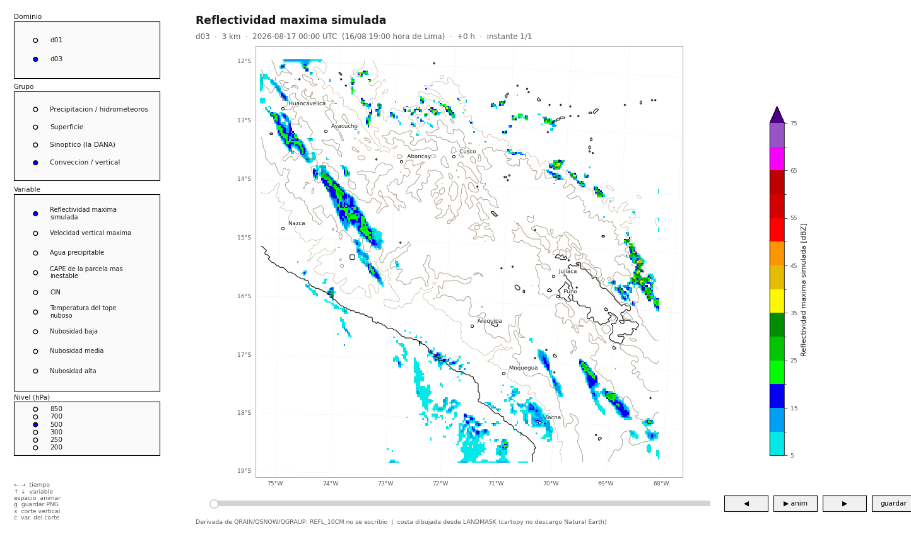
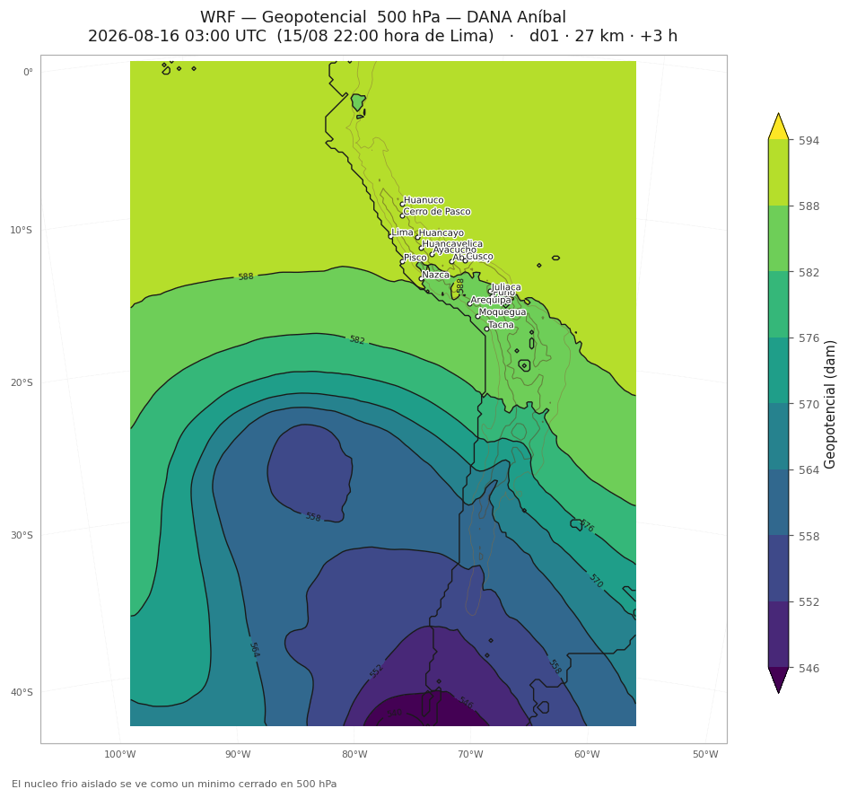
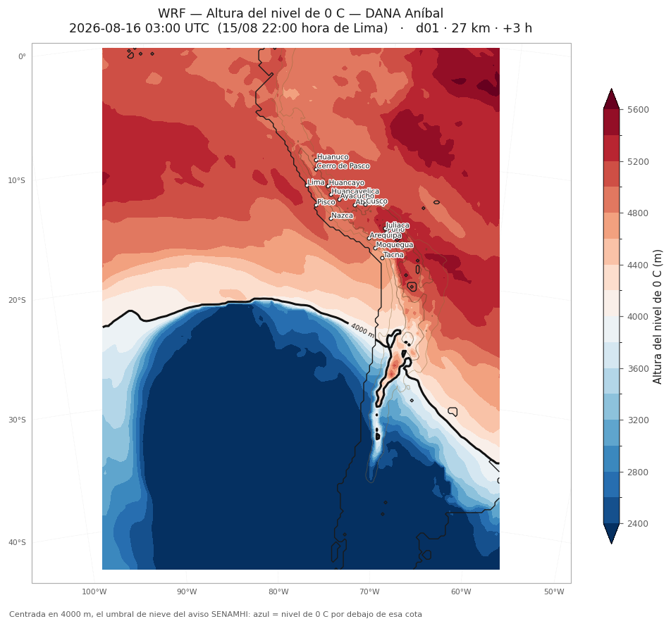
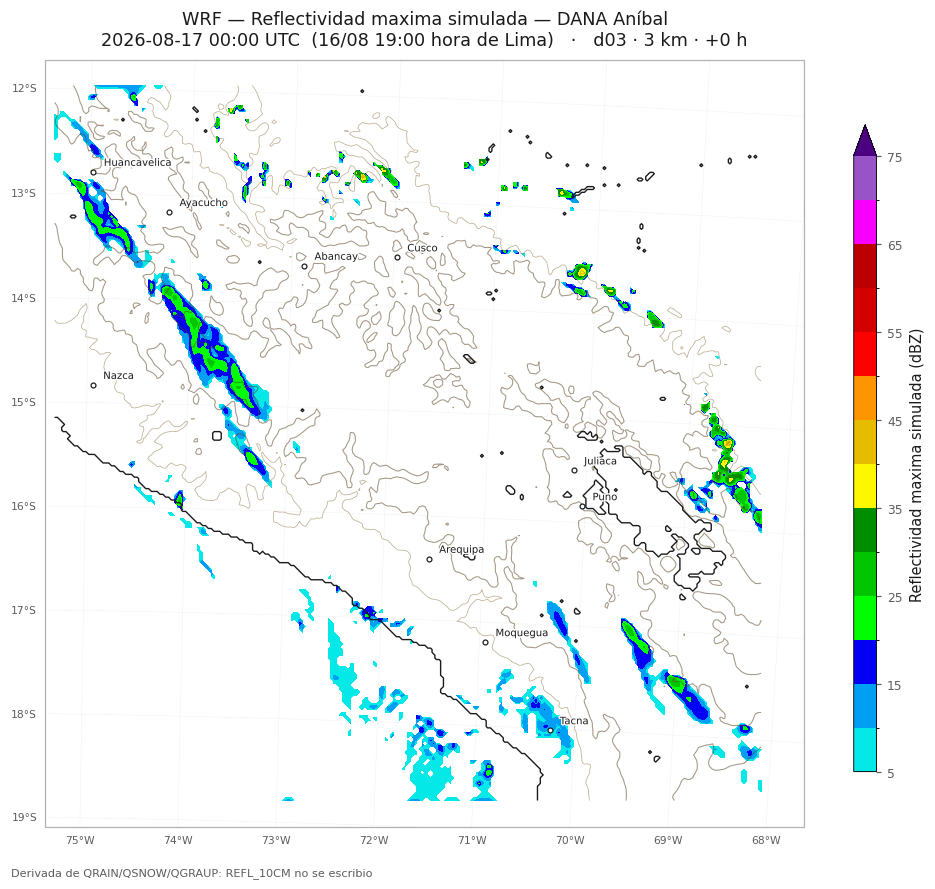
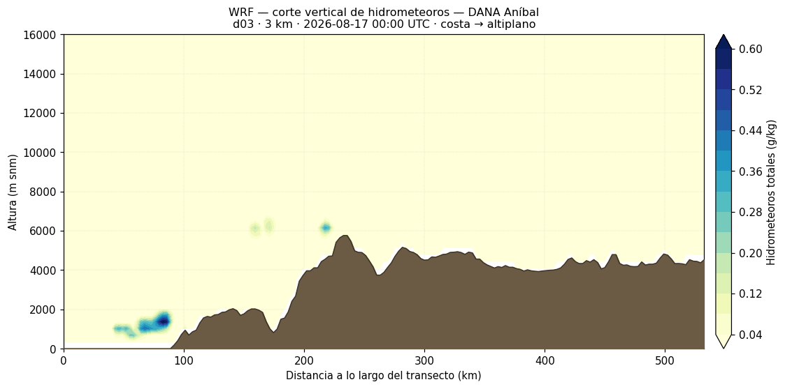
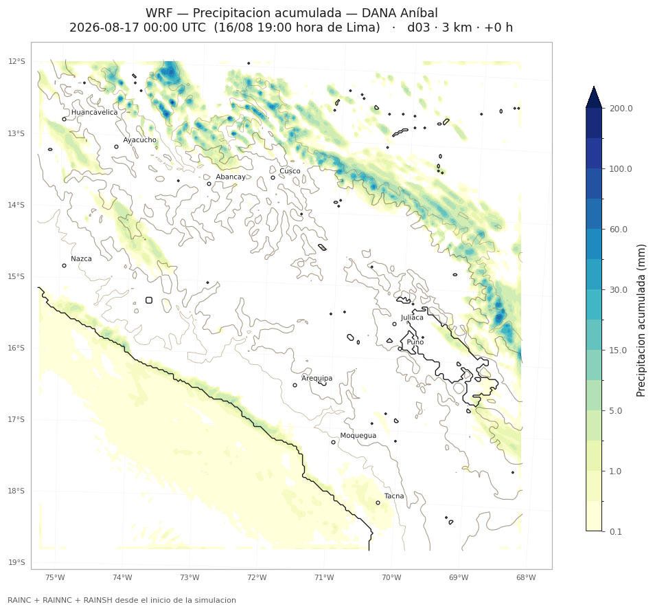
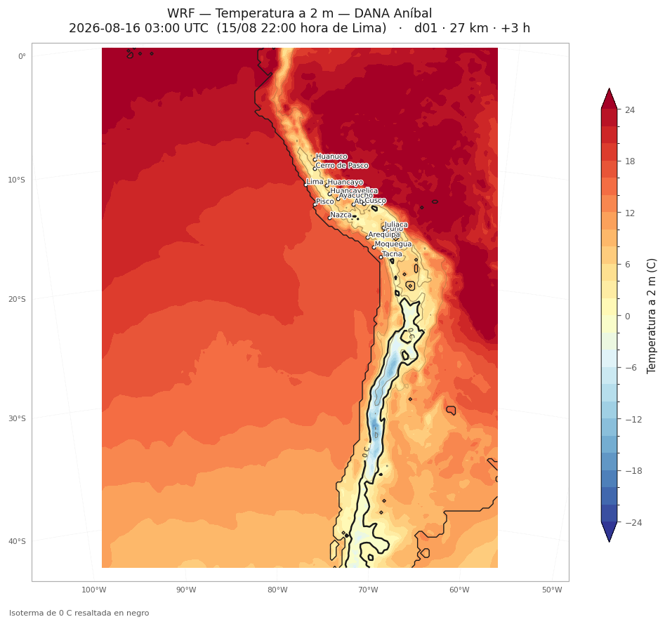

# wrfview — Visor interactivo y generador de figuras para salidas WRF

Herramienta para explorar y publicar resultados de WRF-ARW leyendo los `wrfout_*`
directamente, sin preprocesar nada. Incluye un **visor interactivo** para
navegar la simulación y un **generador por lotes paralelizado** que produce
series de PNG, animaciones GIF y resúmenes del evento.

Desarrollada sobre un caso real: el pronóstico de la **DANA Aníbal** que afectó
al Perú del 16 al 18 de agosto de 2026 (nieve sobre 4000 m, granizo y tormentas
sobre 2600 m en sierra centro y sur, según el aviso de SENAMHI).



## Objetivo

Cerrar el hueco entre "la corrida terminó" y "tengo figuras publicables". El
flujo habitual —abrir el `wrfout` en un notebook, recalcular diagnósticos a
mano, ajustar escalas figura por figura— se rompe cuando hay 283 archivos y
tres dominios anidados. Aquí el catálogo de variables y los diagnósticos viven
en un solo sitio, y tanto el visor como el lote los consumen igual.

## Qué hace

| Modo | Para qué |
|---|---|
| `wrfview.py` | Visor interactivo: deslizador de tiempo, selector de dominio/variable/nivel, lectura del valor bajo el cursor, cortes verticales a dos clics |
| `batch_figuras.py` | Genera series de PNG + GIF, acumulados y máximos del evento, cortes verticales y un CSV de métricas, repartiendo el trabajo entre todos los núcleos |

## Variables

29 diagnósticos en cuatro grupos. Los que no están en el `wrfout` se derivan al
vuelo, así que no hace falta reconfigurar el `namelist.input` y volver a correr.

| Grupo | Variables |
|---|---|
| Precipitación e hidrometeoros | acumulada y por intervalo, nieve (eq. agua y espesor), **granizo**, **graupel**, fracción de precipitación congelada |
| Superficie | T2 con isoterma de 0 °C, punto de rocío, HR, SLP con isobaras y barbas, viento a 10 m, PBLH, temperatura de piel |
| Sinóptico | geopotencial, temperatura, viento y vorticidad relativa, interpolables a 850/700/500/300/250/200 hPa; altura del nivel de 0 °C |
| Convección y vertical | reflectividad simulada, W máxima, agua precipitable, CAPE, CIN, temperatura del tope nuboso, nubosidad baja/media/alta, cortes verticales |

**Derivadas, no leídas**: `SLP`, `REFL_10CM`, `RH2` y `TD2` no se escriben con
la configuración por defecto de WRF. La reflectividad se calcula de
`QRAIN/QSNOW/QGRAUP`, y el nivel de 0 °C interpolando la altura sobre la
superficie `T = 0`.

## Decisiones de visualización

- **El viento a 10 m se rota a norte verdadero** con `SINALPHA`/`COSALPHA`. En
  una proyección Lambert, dibujar `U10`/`V10` en crudo produce barbas giradas
  respecto al norte geográfico.
- **La altura del nivel de 0 °C usa paleta divergente centrada en 4000 m**, no
  una rampa secuencial. Lo que importa operativamente no es la cota en sí sino
  si queda por debajo o por encima del umbral de nieve del aviso: azul = nieve
  posible bajo los 4000 m.
- **Escalas de color fijas por serie.** Las variables sin niveles predefinidos
  se pre-escanean para calcular una escala única; si cada frame se autoescala,
  la animación parpadea.
- **Solo se deja en blanco donde el cero significa ausencia** (lluvia, nieve,
  granizo, reflectividad). En campos continuos como el viento, enmascarar bajo
  el primer nivel produce agujeros donde en realidad hay calma.

| | |
|---|---|
|  |  |
| Núcleo frío aislado en 500 hPa — la DANA | Cota de nieve, centrada en el umbral de 4000 m |
|  |  |
| Reflectividad simulada a 3 km | Corte vertical costa → altiplano |
|  |  |
| Precipitación acumulada en d03 | Temperatura a 2 m, con la isoterma de 0 °C |

## Estructura

```
wrfview.py              lanzador del visor (CLI)
batch_figuras.py        generador por lotes paralelo
wrfview/core.py         inventario, lectura con caché, catálogo y diagnósticos
wrfview/plot.py         proyección, mapa base, paletas, barbas
wrfview/app.py          interfaz interactiva
environment.yml         entorno conda
```

Toda la ciencia está en `core.py`; la capa gráfica no sabe nada de WRF. Añadir
una variable es añadir un `VarSpec` en `build_catalog()`.

## Metodología — notas del desarrollo

- **Inventario defensivo.** Antes de dibujar nada, compara el tamaño de cada
  archivo con el tamaño modal de su dominio (detecta salidas truncadas por
  disco lleno) y el atributo `SIMULATION_START_DATE` con el de la corrida
  mayoritaria (detecta sobrantes de otra corrida). Informa qué descartó y por
  qué. Surgió de una corrida real que llenó el disco a mitad de camino.
- **Paralelismo por procesos, no por hilos.** netCDF4 no admite compartir
  descriptores, así que cada worker tiene su propio `Reader`. Se arranca con
  `spawn` y no con `fork`: heredar por fork descriptores netCDF/HDF5 ya
  abiertos puede corromper lecturas, y de paso el comportamiento es idéntico en
  macOS y en Linux. Cada proceso fija sus hebras BLAS a 1 para que N procesos ×
  N hebras no se estorben.
- **Un solo barrido para todo.** Los máximos y mínimos del evento se calculan
  recorriendo tiempos por fuera y variables por dentro, de modo que cada
  `wrfout` se abre una vez y no una vez por variable. Ese mismo barrido
  devuelve los instantes pico de reflectividad, que es donde se sitúan los
  cortes verticales.
- **Funciona sin wrf-python.** Hay implementaciones propias de presión, altura
  geopotencial, temperatura, interpolación a niveles de presión, HR a 2 m, agua
  precipitable y nivel de congelación, verificadas contra wrf-python dentro del
  0.5 %. Solo `slp`, `td2`, `mdbz`, `cape`, `cin`, `ctt` y los cortes verticales
  lo exigen, y avisan con un mensaje claro en vez de reventar.

### Problemas encontrados y resueltos

| Problema | Causa | Solución |
|---|---|---|
| `wrf.getvar` falla con `Dataset is not picklable` | netCDF4 ≥ 1.7 hace iterables los `Dataset`, y wrf-python entra por una rama pensada para multi-archivo | Fijar `netcdf4<1.7` en el entorno |
| wrf-python no importa: `np.float_ was removed` | wrf-python 1.3.x no es compatible con numpy 2 | Fijar `numpy<2` |
| Las costas no se dibujan y el error no se puede capturar | Cartopy descarga Natural Earth al **dibujar**, no al añadir la capa, así que el `try/except` alrededor de `add_feature` nunca se dispara | Forzar la descarga materializando las geometrías antes; si falla, dibujar la costa desde el `LANDMASK` del propio `wrfout` |
| `NetCDF: Not a valid ID` al calcular precipitación por intervalo | El diagnóstico abre el instante anterior mientras el actual sigue en uso; con caché de 1 dataset, la expulsión cerraba el fichero que se estaba leyendo | Suelo de 2 datasets en el `Reader` |
| Agujeros blancos sobre la cordillera en el campo de viento | Se enmascaraba todo lo que caía bajo el primer nivel — regla correcta para lluvia, absurda para viento en calma | Marca `mask_below` por variable, activa solo donde el cero es ausencia |
| Huecos sin rellenar aun sin enmascarar | `contourf` no rellena por debajo del nivel más bajo salvo que la extensión lo incluya | Extensión efectiva calculada en la norma, compartida entre el relleno y la barra de color |
| `ValueError: 15 color bins but ncolors = 14` | La paleta discreta de reflectividad tenía menos colores que intervalos pedían sus niveles | Reescalar la paleta al número de intervalos en `make_norm`, para cualquier variable |
| El dominio aparecía recortado por el borde sur | Sin `set_extent`, cartopy autoescala al último artista dibujado — y ahí se perdía justo el mínimo de la DANA | `set_extent` explícito a las esquinas del dominio |
| Las animaciones tardaban muchísimo | No era el ensamblado del GIF sino el tamaño de los frames | Reescalado a 1000 px y cuantización a 256 colores **en paralelo** antes de montar el GIF |

## Rendimiento

Medido sobre 2 núcleos: 21 s → 13 s (1,6×). Con 8–12 núcleos el factor sube a
5–8×. Órdenes de magnitud para las 16 variables del lote completo con 8
núcleos, sobre una corrida de 3,5 días con tres dominios anidados:

| Dominio | Instantes | Tiempo aprox. |
|---|---|---|
| d01 (27 km, 3-horario) | 29 | un par de minutos |
| d02 (9 km, horario) | 85 | ~10 min |
| d03 (3 km, cada 30 min) | 169 | 30–45 min (la mitad con `--salto 2`) |

## Dependencias

```bash
conda env create -f environment.yml
conda activate wrfview
```

`wrf-python` no tiene rueda de pip para Apple Silicon; conda-forge sí trae
compilación `osx-arm64`, por eso el entorno es conda y no `requirements.txt`.
Las versiones de `numpy` y `netcdf4` están fijadas a propósito (ver la tabla de
problemas).

Sin `wrf-python` la mayoría de variables siguen funcionando con las
implementaciones propias.

## Uso rápido

```bash
# Visor interactivo
python wrfview.py --dir /ruta/a/em_real

# Qué archivos son utilizables y cuáles se descartaron
python wrfview.py --dir /ruta/a/em_real --inventario

# Catálogo completo de variables
python wrfview.py --dir /ruta/a/em_real --variables

# Lote completo, todos los núcleos
python batch_figuras.py --dir /ruta/a/em_real

# Solo d03 a paso horario, 8 procesos
python batch_figuras.py --dir /ruta/a/em_real --dominios d03 --salto 2 --workers 8

# Solo acumulados y máximos del evento (rápido de revisar)
python batch_figuras.py --dir /ruta/a/em_real --solo-resumen --sin-cortes
```

### Controles del visor

| | |
|---|---|
| `←` `→` | tiempo (`Shift` salta 6) |
| `↑` `↓` | variable anterior / siguiente del grupo |
| `espacio` | animar / pausar |
| `g` | guardar PNG |
| `x` | corte vertical (clic en inicio y en final) |
| `c` | cambiar la variable del corte |
| ratón | valor, lat/lon y altura del terreno bajo el cursor |

## Caso de ejemplo: DANA Aníbal

| Parámetro | Valor |
|---|---|
| Dominios | 3 anidados: 27 / 9 / 3 km |
| Puntos de grilla | 138×181, 229×265, 250×253 |
| Niveles verticales | 45, tope en 5000 Pa |
| Proyección | Lambert conforme, centro −22.5°, −77.5° |
| Periodo | 2026-08-15 18Z → 2026-08-19 06Z |
| Forzante | GFS 0.25°, 3-horario |
| Física | Thompson, Kain-Fritsch (d01/d02), RRTMG, YSU, Noah |

## Pendiente

- [ ] Series temporales por ciudad (T2, precipitación acumulada, viento) en un
      solo gráfico multipanel.
- [ ] Verificación contra observaciones de SENAMHI donde haya estaciones.
- [ ] Reproyectar a lat/lon regular para exportar a GeoTIFF.
- [ ] Modo comparación de dos corridas, al estilo del análisis GFS vs ERA5.

## Licencia

MIT.
